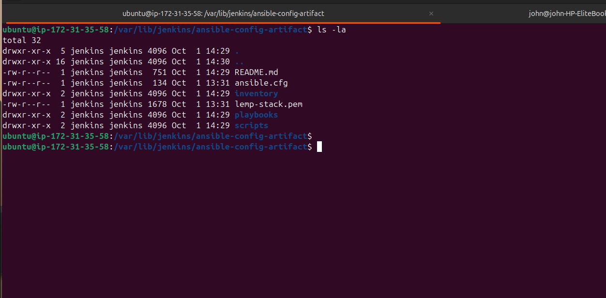
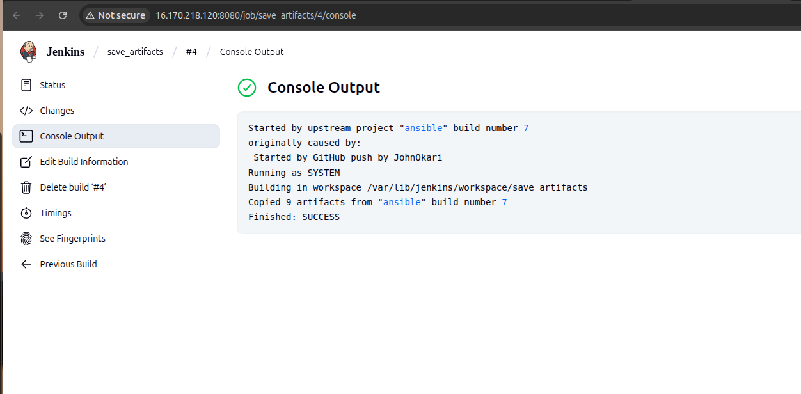

# Ansible Refactoring & Static Assignments (Imports and Roles) — Project 102

**Purpose:**
This README walks you step-by-step through the refactor and improvements described in Project 102:

* Make Jenkins artifacts neat (single artifact directory)
* Refactor Ansible playbooks using `import_playbook` and a `site.yml` entry point
* Create a reusable `webserver` role and apply it to UAT web servers

> This guide assumes your repository root is `/home/ubuntu/ansible-config-mgt` on the Jenkins-Ansible server. Adjust paths accordingly if yours differ.

---

## Table of contents

1. Prerequisites
2. Repo layout (before / after)
3. Step 1 — Jenkins job enhancement (save artifacts)
4. Step 2 — Refactor Ansible with `site.yml` and `static-assignments`
5. Step 3 — Create `webserver` role and its tasks
6. Step 4 — Reference the `webserver` role (uat-webservers assignment)
7. Step 5 — Commit, PR, run and test
8. Verification & troubleshooting
9. Best practices & next steps

---

## 1) Prerequisites

* Jenkins server where the `ansible` job already exists.
* `Copy Artifact` Jenkins plugin (we'll install it if missing).
* Ansible installed on the Jenkins-Ansible instance.
* GitHub repo `ansible-config-mgt` cloned to `/home/ubuntu/ansible-config-mgt`.
* SSH access to servers (ssh-agent forwarding recommended), and permissions to create directories on the Jenkins host.
* Two RHEL 8 EC2 instances for UAT (Web1-UAT and Web2-UAT).

> Note: When working with RHEL 8 take into account `firewalld` and SELinux. This README includes small tasks to help with firewall/http access.

---

## 2) Repo layout

### BEFORE

```
ansible-config-mgt/
├── inventory/
│   ├── dev.yml
│   ├── stage.yml
│   ├── uat.yml
│   └── prod.yml
├── playbooks/
│   └── common.yml        # everything in one big playbook
├── ansible.cfg
└── ...
```

### AFTER (refactor)

```
ansible-config-mgt/
├── static-assignments/
│   ├── common.yml
│   ├── common-del.yml
│   └── uat-webservers.yml
├── playbooks/
│   └── site.yml
├── roles/
│   └── webserver/
│       ├── defaults/main.yml
│       ├── handlers/main.yml
│       ├── tasks/main.yml
│       └── templates/
├── inventory/
│   └── uat.yml
└── ansible.cfg            # with roles_path set to ./roles (full path)
```

---

## 3) Step 1 — Jenkins job enhancement (save_artifacts)

The goal: have a single directory on the Jenkins-Ansible server where artifacts are copied after each `ansible` job run.

### 1.1 Create artifact directory on Jenkins host

```bash
sudo mkdir -p /home/ubuntu/ansible-config-artifact
sudo chmod -R 0777 /home/ubuntu/ansible-config-artifact
# (Optional) change owner if you prefer: sudo chown -R jenkins:jenkins /home/ubuntu/ansible-config-artifact
```

### 1.2 Install Copy Artifact plugin in Jenkins

1. Open Jenkins web UI -> **Manage Jenkins** -> **Manage Plugins** -> **Available**.
2. Search **Copy Artifact**, install it **without** restart (or with restart if you prefer).

### 1.3 Create `save_artifacts` Freestyle project

1. **New Item** -> Freestyle project -> name it `save_artifacts`.
2. **Build Triggers**: choose **Build after other projects are built** and put `ansible` (your existing job name) — this makes `save_artifacts` run when `ansible` finishes.
3. **Build Environment**: none required specifically.
4. **Build** -> **Add build step** -> **Copy artifacts from another project**:

   * Project name: `ansible`
   * Which build: `Latest successful build` (or `Triggered build` if you chain builds)
   * Artifacts to copy: `**` (or specify patterns)
   * Target directory: `/home/ubuntu/ansible-config-artifact`
5. **Post-build Actions**: none required.
6. (Recommended) **Discard old builds**: set **Max # of builds to keep** to e.g. `5` to save space.

### 1.4 Test

* Edit `README.md` or any file in the `master` branch of your repo and push.
* Jenkins `ansible` job should run and then `save_artifacts` should run.
* On Jenkins host run:

```bash
ls -la /home/ubuntu/ansible-config-artifact
```
  
  

* You should see the copied artifacts. If not, check Jenkins job console for errors.

---

## 4) Step 2 — Refactor Ansible with `site.yml` and `static-assignments`

This step converts single-file playbooks into an import-based layout.

### 2.1 Create `refactor` branch and prepare repo

```bash
cd /home/ubuntu/ansible-config-mgt
git checkout -b refactor
```

### 2.2 Create `static-assignments/` and move `common.yml`

```bash
mkdir -p static-assignments
git mv playbooks/common.yml static-assignments/common.yml
```

If you used `common.yml` in `playbooks/` before, move it as shown. Otherwise create new playbooks inside `static-assignments/`.

### 2.3 Add `playbooks/site.yml` (entry point)

Create `playbooks/site.yml` with the following content. **Each imported file contains its own `- hosts:` block.**

```yaml
---
- import_playbook: ../static-assignments/common.yml
# later we will add:
- import_playbook: ../static-assignments/common-del.yml
- import_playbook: ../static-assignments/uat-webservers.yml
```

> Put relative paths because `site.yml` lives in `playbooks/`.

### 2.4 Example: `static-assignments/common-del.yml` (delete wireshark)

Save this file as `static-assignments/common-del.yml`:

```yaml
---
- name: update web, nfs and db servers
  hosts: webservers, nfs, db
  remote_user: ec2-user
  become: yes
  become_user: root
  tasks:
  - name: delete wireshark
    yum:
      name: wireshark
      state: removed

- name: update LB server
  hosts: lb
  remote_user: ubuntu
  become: yes
  become_user: root
  tasks:
  - name: delete wireshark
    apt:
      name: wireshark-qt
      state: absent
      autoremove: yes
      purge: yes
      autoclean: yes
```

### 2.5 Run the playbook against `dev` inventory

```bash
cd /home/ubuntu/ansible-config-mgt
ansible-playbook -i inventory/dev.yml playbooks/site.yml
```

Verify `wireshark` is removed on target servers (e.g. `wireshark --version` or `which wireshark` should fail).

---

## 5) Step 3 — Configure UAT Webservers with a `webserver` role

We will create a reusable role to install Apache, pull the tooling site and ensure it is served at `/var/www/html`.

### 5.1 Launch UAT EC2 instances

* Launch two RHEL 8 EC2 instances and give them names `Web1-UAT` and `Web2-UAT`.
* Add them to `inventory/uat.yml` with `ansible_ssh_user` set (e.g. `ec2-user`). Example `inventory/uat.yml`:

```ini
[uat-webservers]
10.0.1.12 ansible_ssh_user=ec2-user
10.0.1.13 ansible_ssh_user=ec2-user
```

> Use private IPs for Ansible (reachable from Jenkins host). For public testing you can use public IPs in the browser.

### 5.2 Create the `roles/` structure

From repository root:

```bash
mkdir -p roles
cd roles
ansible-galaxy init webserver   # creates standard role scaffold
# OR create manually the dirs you need
```

Trim away tests or unused scaffold files if desired. Minimal role structure:

```
roles/webserver/
├── defaults/main.yml
├── handlers/main.yml
├── tasks/main.yml
├── templates/
└── README.md
```

### 5.3 Set `roles_path` in Ansible config

Edit `/etc/ansible/ansible.cfg` (or repo ansible.cfg). Uncomment/set:

```ini
roles_path = /home/ubuntu/ansible-config-mgt/roles
```

Or if you prefer repo-level config, create `ansible.cfg` at repo root and add the roles_path with full path.

### 5.4 Role contents — samples

**roles/webserver/defaults/main.yml**

```yaml
---
tooling_repo_url: "https://github.com/<your-name>/tooling.git"
doc_root: "/var/www/html"
```

**roles/webserver/handlers/main.yml**

```yaml
---
- name: restart httpd
  ansible.builtin.service:
    name: httpd
    state: restarted
```

**roles/webserver/tasks/main.yml**

```yaml
---
- name: install httpd
  become: true
  ansible.builtin.yum:
    name: "httpd"
    state: present

- name: install git
  become: true
  ansible.builtin.yum:
    name: "git"
    state: present

- name: clone tooling repo
  become: true
  ansible.builtin.git:
    repo: "{{ tooling_repo_url }}"
    dest: "{{ doc_root }}"
    force: yes

- name: copy html content to one level up (if tooling uses nested html folder)
  become: true
  command: bash -lc "cp -r {{ doc_root }}/html/ /var/www/ || true"
  args:
    warn: false

- name: start and enable httpd
  become: true
  ansible.builtin.service:
    name: httpd
    state: started
    enabled: yes

- name: remove nested html directory if exists
  become: true
  ansible.builtin.file:
    path: "{{ doc_root }}/html"
    state: absent
```

> Notes:
>
> * You can use `dnf` on RHEL 8 instead of `yum` if you prefer.
> * If the site is PHP (index.php), ensure PHP packages are installed; this example assumes static/PHP index present in `tooling` repo.

### 5.5 Handle firewall + SELinux (suggested tasks)

If your UAT RHEL servers have `firewalld` enabled, add a small task to open HTTP port:

```yaml
- name: open http service in firewalld
  become: true
  ansible.builtin.command: firewall-cmd --permanent --add-service=http
  register: fw_change
  changed_when: fw_change.rc == 0
  failed_when: fw_change.rc not in [0,254]

- name: reload firewalld
  become: true
  ansible.builtin.command: firewall-cmd --reload
  when: fw_change.changed
```

For SELinux, do not disable in production — prefer using `semanage` / restorecon. For quick tests you can run `setenforce 0` (transient) but document it.

---

## 6) Step 4 — Reference `webserver` role

Create `static-assignments/uat-webservers.yml` with:

```yaml
---
- hosts: uat-webservers
  become: yes
  roles:
    - webserver
```

Update `playbooks/site.yml` to include the new assignment:

```yaml
---
- import_playbook: ../static-assignments/common.yml
- import_playbook: ../static-assignments/common-del.yml
- import_playbook: ../static-assignments/uat-webservers.yml
```

---

## 7) Step 5 — Commit, PR, run & test

### 7.1 Git flow

```bash
# on your local workstation or the Jenkins-Ansible server
cd /home/ubuntu/ansible-config-mgt
git add -A
git commit -m "refactor: split playbooks, add webserver role and uat assignment"
git push origin refactor
# Open a Pull Request on GitHub, review, and merge to master (or main).
```

### 7.2 Jenkins auto-run & artifact check

* After merging, your GitHub webhook should trigger the `ansible` job and then `save_artifacts`.
* On Jenkins host check: `ls -la /home/ubuntu/ansible-config-artifact`

### 7.3 Run playbook against UAT

```bash
# ensure SSH agent is running and your SSH key is loaded
eval "$(ssh-agent -s)"
ssh-add /path/to/your/private_key.pem
# run the site against uat
ansible-playbook -i inventory/uat.yml playbooks/site.yml
```

### 7.4 Verify web servers are serving site

From your laptop or a jump host, try:

```
curl -I http://<Web1-UAT-public-ip>/index.php
curl -I http://<Web2-UAT-public-ip>/index.php
```

Or open in browser:

```
http://<Web1-UAT-public-ip>/index.php
http://<Web2-UAT-public-ip>/index.php
```

Also check service status on each UAT server:

```bash
ssh ec2-user@<UAT-private-IP>
sudo systemctl status httpd
sudo firewall-cmd --list-all
getenforce   # SELinux status
```

---

## 8) Verification & Troubleshooting

**Artifacts not copied to `/home/ubuntu/ansible-config-artifact`**

* Check `save_artifacts` job console output for errors and the configured Target directory.
* Ensure Jenkins user has write permission to that directory (chown or chmod accordingly).

**`git clone` or `git` tasks failing in playbook**

* If cloning via HTTPS, ensure repo is public or credentials are available.
* If cloning via SSH (`git@github.com...`) ensure the SSH key is present and the Jenkins-Ansible host has access.
* If you see `Permission denied` when writing to target dir (e.g. /var/www/html), ensure `become: true` is set and ownership is correct.

**Playbook can't find role `webserver`**

* Verify `roles_path` contains the correct full path.
* Check role folder name is exactly `webserver` under the `roles/` path.

**RHEL 8 — site returns 403 or blank**

* Check `sudo chown -R apache:apache /var/www` (on RHEL the httpd user is `apache`). Some distros use `www-data` (Debian/Ubuntu).
* Check SELinux contexts: `sudo restorecon -R /var/www` or use `semanage fcontext` to set proper contexts.
* Open firewall port: `sudo firewall-cmd --permanent --add-service=http && sudo firewall-cmd --reload`

**SSH agent forwarding / permission issues**

* Use `ssh -A` when connecting to the Jenkins host for agent forwarding, or add the key directly with `ssh-add` on the Jenkins host.

---

## 9) Best practices & next steps

* **Variables & defaults:** Put repository-specific values (repo URL, docroot, package names) into `roles/webserver/defaults/main.yml` and override via inventory group_vars.
* **Idempotency:** Make sure tasks are idempotent. Avoid destructive `command` tasks when a module exists.
* **Handlers:** Use handlers for service restarts to avoid unnecessary restarts.
* **Testing:** Use `ansible-lint` and `molecule` to unit-test roles.
* **Secrets:** Use `ansible-vault` for credentials.
* **Tagging:** Add `tags:` to tasks so you can run subsets: `--tags 'webserver,install'`.
* **CI:** Consider converting `ansible` Freestyle job to a Jenkins Pipeline/Jenkinsfile for reproducibility.

---

## Appendix — Quick reference commands

```bash
# create artifact dir
sudo mkdir -p /home/ubuntu/ansible-config-artifact
sudo chmod -R 0777 /home/ubuntu/ansible-config-artifact

# branch & push
git checkout -b refactor
git add -A
git commit -m "refactor: split playbooks and add webserver role"
git push -u origin refactor

# run playbook
ansible-playbook -i inventory/uat.yml playbooks/site.yml

# check artifcats
ls -la /home/ubuntu/ansible-config-artifact
```

---
